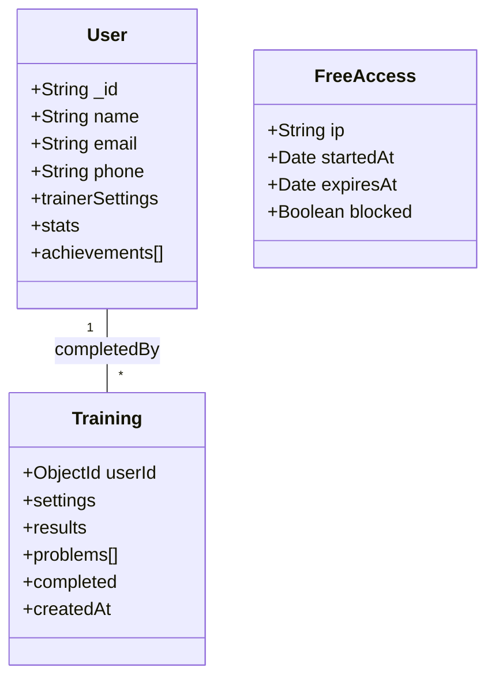
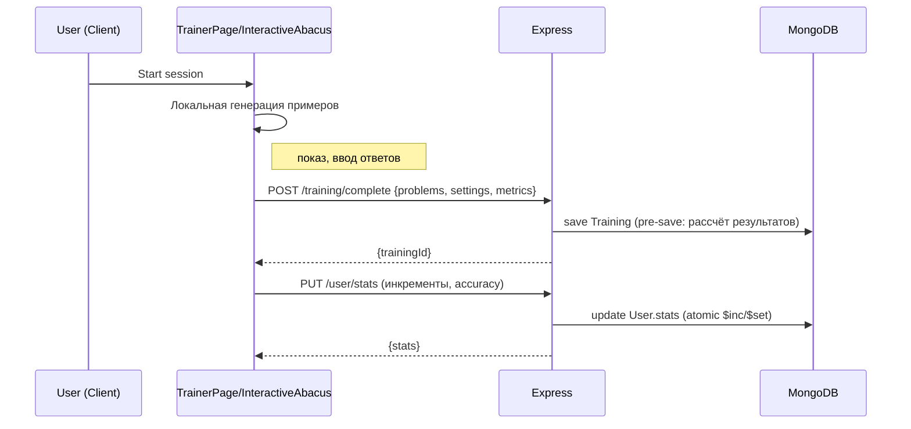
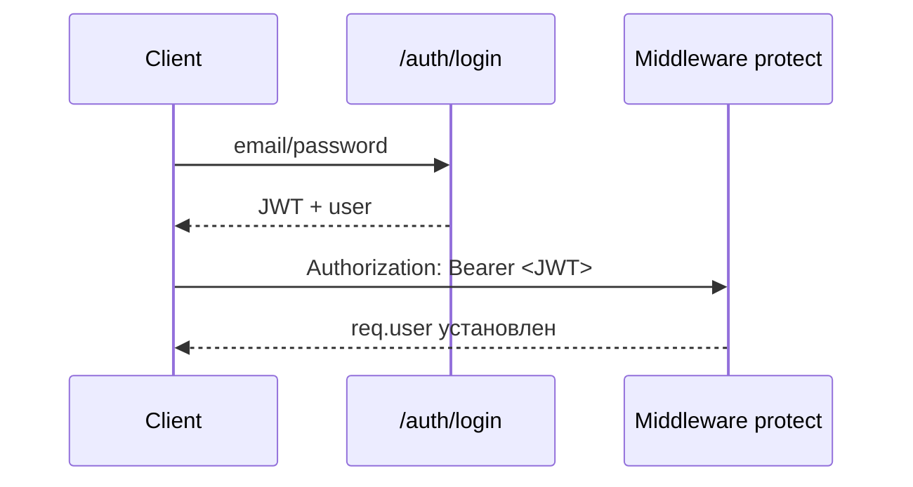
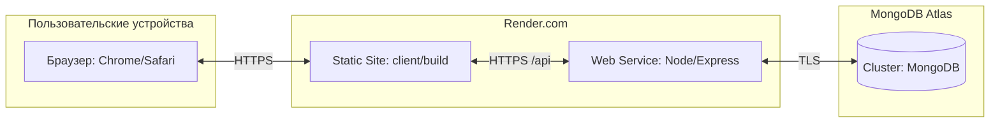
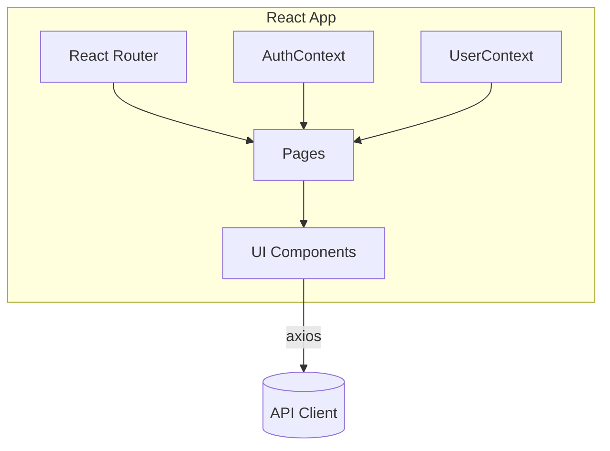
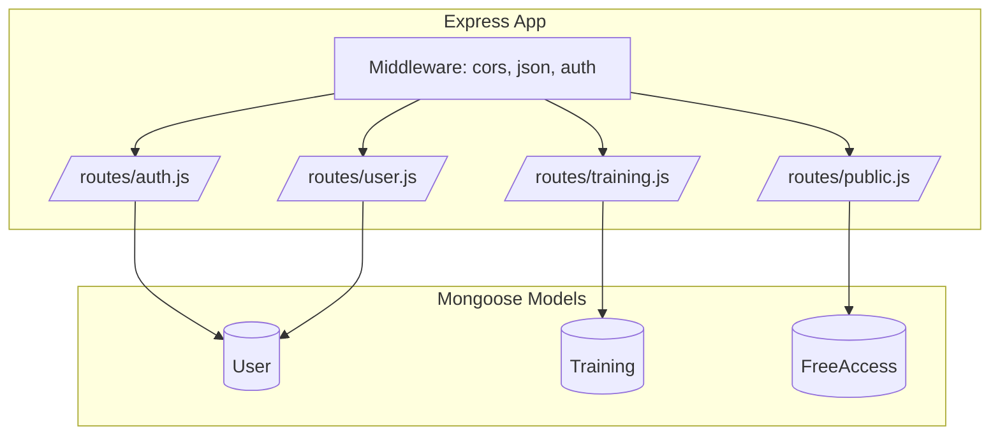
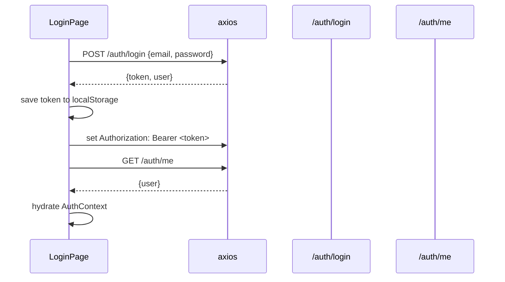
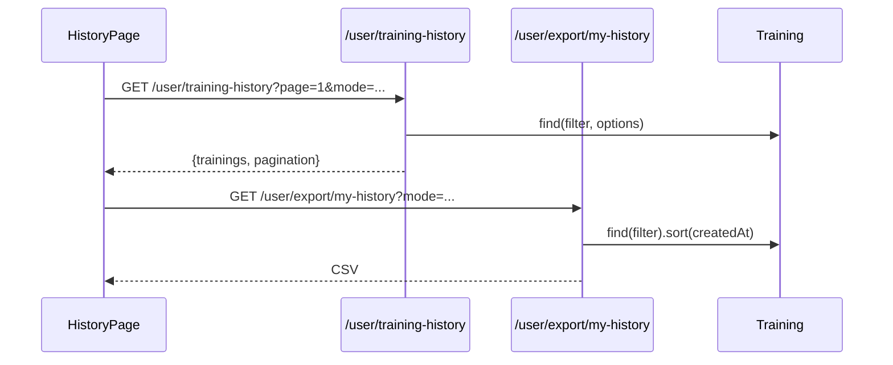
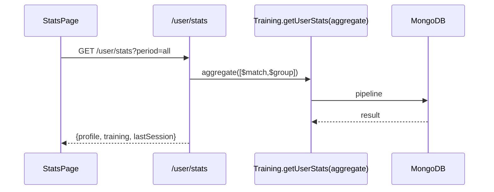

## Архитектура проекта

Ниже — визуальные схемы основных блоков системы. Формат — Mermaid (рендерится в GitHub/Markdown-плагинах).

### 1) Общая схема (Container level)

```mermaid
flowchart LR
  subgraph Client[Client (React + MUI)]
    A1[Маршруты: /, /trainer, /stats, /profile]
    A2[Контексты: AuthContext, UserContext]
    A3[Страницы: TrainerPage, StatsPage, HistoryPage, ProfilePage]
    A4[Компоненты: Abacus, TrainerAbacus]
    A5[Utils: problemGenerator]
  end

  subgraph Server[Server (Node.js/Express)]
    B1[/auth/*: login, register, me, profile, change-password]
    B2[/user/*: trainer-settings, stats, progress, training-history, export]
    B3[/training/*: complete, problem, start]
    B4[/public/free-access]
    B5[Middleware: auth(protect, authorize)]
  end

  subgraph DB[(MongoDB)]
    C1[(User)]
    C2[(Training)]
    C3[(FreeAccess)]
  end

  Client <--> |JWT в headers| Server
  Server <--> DB
```

### 2) Модель данных



### 3) Поток тренировки (digits/abacus)



### 4) Статистика и история

```mermaid
flowchart TB
  subgraph Stats
    S1[/user/stats/] -->|getUserStats(aggregate)| T[(Training)]
    S1 --> U[(User.stats)]
    S2[HistoryPage] --> H1[/user/training-history/]
  end

  T -.индексы.-> T
```

### 5) Авторизация



Примечания
- JWT хранится на клиенте, добавляется в `axios` заголовки.
- История тренировок хранится в `Training`, агрегаты профиля — в `User.stats`.
- Для гостей доступ к абакусу контролируется через `FreeAccess` и `/public/free-access`.

---

### 6) Диаграмма деплоя/инфраструктуры



---

### 7) Component-level (Client)



---

### 8) Component-level (Server)



---

### 9) Поток: Логин и bootstrap клиента



---

### 10) Поток: История и экспорт



---

### 11) Поток: Агрегации статистики




